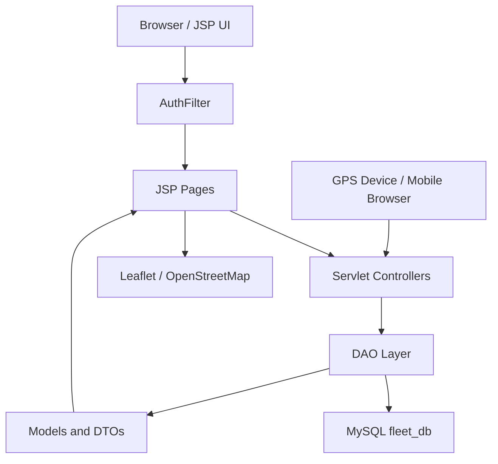

# Smart Vehicle Fleet Management System Documentation

## 1. Project Overview

Smart Vehicle Fleet Management System is a Java Maven web application for managing fleet vehicles, drivers, vehicle assignments, live GPS tracking, geofence alerts, and fuel monitoring.

The application is built with Jakarta Servlets, JSP pages, JDBC, MySQL, Bootstrap, Bootstrap Icons, Leaflet maps, and Maven WAR packaging. It follows a simple MVC-style structure:

- JSP files render the user interface.
- Servlet classes handle requests, validations, session messages, redirects, and JSON APIs.
- DAO classes communicate with the MySQL database through JDBC.
- Model and DTO classes move data between DAOs, servlets, and JSP pages.
- SQL scripts create and seed the database.

## 2. Main Features

- User login and logout with session-based access control.
- Dashboard with navigation to fleet modules.
- Vehicle CRUD: add, list, search, filter, view, update, and delete vehicles.
- Driver CRUD: add, list, search, filter, view, update, and delete drivers.
- Vehicle assignment management:
  - Assign active vehicles to active drivers.
  - Prevent duplicate active vehicle/driver assignments.
  - View current assignments.
  - View full assignment history.
  - Unassign vehicles by closing the assignment with an end date.
- Live GPS tracking:
  - Accept location updates through an API endpoint.
  - Store location points in MySQL.
  - Display latest locations on a Leaflet map.
  - Display route history for an individual vehicle.
- Mobile tracking support:
  - Browser-based mobile tracking page.
  - API key based GPS updates.
  - GPSLogger style configuration guidance.
- GPS API key configuration page.
- Geofence management:
  - Create geofences around vehicle operating zones.
  - Enable, disable, and delete geofences.
  - Automatically create alerts when a tracked vehicle moves outside a configured radius.
  - Automatically resolve open alerts when the vehicle returns inside the geofence.
  - Manually resolve alerts from the UI.
- Fuel monitoring:
  - Add and delete fuel logs.
  - Filter fuel logs.
  - View monthly spend, monthly liters, per-vehicle efficiency, and summary statistics.
- Maintenance notifications:
  - View vehicles with overdue or upcoming maintenance dates.
  - Create maintenance reminders for selected vehicles.
  - Mark maintenance as scheduled, completed, cancelled, or deleted.

## 3. Technology Stack

| Layer | Technology |
| --- | --- |
| Language | Java 17 |
| Build Tool | Maven |
| Packaging | WAR |
| Web Framework | Jakarta Servlet API 6.0 and JSP API 3.1 |
| Server Target | Tomcat 10.1 or another Jakarta EE 10 compatible servlet container |
| Database | MySQL |
| Database Access | JDBC with MySQL Connector/J 8.3.0 |
| UI | JSP, HTML, CSS, Bootstrap 5.3.2, Bootstrap Icons |
| Maps | Leaflet 1.9.4 and OpenStreetMap tiles |
| Legacy/alternate map page | Google Maps script in `live-map.jsp` |

## 4. Project Structure

```text
Smart_Vehicle_Fleet/
|-- pom.xml
|-- README.md
|-- fuel_monitoring_setup.sql
|-- src/
|   |-- main/
|       |-- java/
|       |   |-- com/fleet/
|       |       |-- dao/
|       |       |-- dto/
|       |       |-- filter/
|       |       |-- model/
|       |       |-- servlet/
|       |-- resources/
|       |   |-- database.sql
|       |-- webapp/
|           |-- *.jsp
|           |-- WEB-INF/web.xml
|-- target/
```

### Important Directories

| Path | Purpose |
| --- | --- |
| `src/main/java/com/fleet/dao` | JDBC database access classes. |
| `src/main/java/com/fleet/model` | Plain Java model objects that represent database records. |
| `src/main/java/com/fleet/dto` | View-specific data transfer objects for joined or display-ready data. |
| `src/main/java/com/fleet/servlet` | Request handlers and JSON API endpoints. |
| `src/main/java/com/fleet/filter` | Authentication filter for protected JSP pages. |
| `src/main/resources/database.sql` | Main database creation and seed script. |
| `fuel_monitoring_setup.sql` | Fuel module table and sample data script. |
| `src/main/webapp` | JSP views for all UI pages. |
| `src/main/webapp/WEB-INF/web.xml` | Legacy deployment descriptor. Servlet mapping is mainly annotation-based. |

## 5. Build Configuration

The project is configured in `pom.xml`.

Important Maven settings:

- Group ID: `com.Smart_Vehicle_Fleet`
- Artifact ID: `Smart_Vehicle_Fleet`
- Version: `0.0.1-SNAPSHOT`
- Packaging: `war`
- Final WAR name: `Smart_Vehicle_Fleet.war`
- Java source and target: `17`

Main dependencies:

- `jakarta.servlet:jakarta.servlet-api:6.0.0`
- `jakarta.servlet.jsp:jakarta.servlet.jsp-api:3.1.0`
- `com.mysql:mysql-connector-j:8.3.0`
- `junit:junit:3.8.1`

The servlet and JSP APIs are marked as `provided`, which means the application server provides them at runtime.

## 6. System Requirements

Install the following before running the project:

- JDK 17 or later.
- Maven 3.8 or later.
- MySQL Server 8.x.
- Apache Tomcat 10.1 or another Jakarta Servlet 6 compatible server.
- Eclipse IDE is optional but supported because the project includes Eclipse metadata files.

## 7. Database Configuration

The application connects to MySQL using hardcoded JDBC settings in multiple DAO classes.

Current connection values:

```text
URL:      jdbc:mysql://localhost:3306/fleet_db
Username: root
Password: shubham@1234
```

Classes that define database connection details:

- `DBConnection`
- `UserDAO`
- `VehicleDAO`
- `DriverDAO`
- `VehicleAssignmentDAO`
- `LocationDAO`
- `GeofenceDAO`

For production or team development, these values should be moved into environment variables, a properties file, JNDI datasource, or application server configuration.

## 8. Database Setup

### Step 1: Create Main Schema

Run the main SQL script:

```bash
mysql -u root -p < src/main/resources/database.sql
```

This creates:

- `fleet_db`
- `roles`
- `users`
- `vehicles`
- `drivers`
- `vehicle_assignments`
- `vehicle_locations`
- `gps_api_keys`
- `geofences`
- `geofence_alerts`

It also inserts sample users, vehicles, drivers, assignments, locations, GPS API keys, geofences, and demo geofence alerts.

### Step 2: Create Fuel Module Table

Run the fuel monitoring script after the main script:

```bash
mysql -u root -p fleet_db < fuel_monitoring_setup.sql
```

This creates:

- `fuel_logs`

It also inserts sample fuel records.

### Step 3: Create Maintenance Notification Table

Run the maintenance setup script:

```bash
mysql -u root -p fleet_db < maintenance_setup.sql
```

This creates:

- `maintenance_notifications`

It also inserts sample maintenance notification records.

## 9. Default Login Accounts

The seed script creates these users:

| Role | Email | Password |
| --- | --- | --- |
| Admin | `admin@fleet.com` | `admin123` |
| Manager | `manager@fleet.com` | `manager123` |
| Driver | `driver@fleet.com` | `driver123` |

Important: passwords are stored in plain text in the current schema and code. This is acceptable for a student/demo project, but production code should hash passwords with BCrypt or another strong password hashing algorithm.

## 10. Running the Application

### Build the WAR

```bash
mvn clean package
```

The generated WAR file will be:

```text
target/Smart_Vehicle_Fleet.war
```

### Deploy to Tomcat

Copy the WAR file into Tomcat's `webapps` directory:

```bash
copy target\Smart_Vehicle_Fleet.war C:\path\to\tomcat\webapps\
```

Start Tomcat, then open:

```text
http://localhost:8080/Smart_Vehicle_Fleet/login.jsp
```

Depending on the server configuration, the context path may be:

```text
/Smart_Vehicle_Fleet
```

## 11. Application Architecture



### Request Flow

1. User opens a JSP page or submits a form.
2. `AuthFilter` checks whether the user is logged in for protected pages.
3. JSP pages either render data directly through DAOs or submit to servlets.
4. Servlets validate input, create model objects, call DAOs, and set success/error messages.
5. DAO classes execute SQL through JDBC.
6. The result is rendered by JSP pages or returned as JSON for map pages.

## 12. Authentication and Sessions

### Login

Login is handled by:

- JSP: `login.jsp`
- Servlet: `LoginServlet`
- DAO: `UserDAO`

Flow:

1. User submits email and password to `/login`.
2. `LoginServlet` calls `UserDAO.authenticate(email, password)`.
3. If credentials match, a `User` object is stored in session under `currentUser`.
4. User role is stored in session under `userRole`.
5. The user is redirected to `dashboard.jsp`.
6. Invalid credentials forward back to `login.jsp` with an error message.

### Logout

Logout is handled by:

- Servlet: `LogoutServlet`
- URL: `/logout`

The servlet invalidates the session and redirects to `login.jsp`.

### Protected Pages

`AuthFilter` protects these pages:

- `dashboard.jsp`
- Vehicle pages
- Driver pages
- Assignment pages
- Live tracking pages
- Mobile tracking page
- GPS API config page
- Admin and manager path patterns

The filter redirects unauthenticated users to `login.jsp`.

## 13. JSP Pages

| JSP Page | Purpose |
| --- | --- |
| `login.jsp` | Login form. |
| `dashboard.jsp` | Main navigation and summary dashboard. |
| `index.jsp` | Basic landing/dashboard style page. |
| `vehicle-list.jsp` | List, search, filter, and manage vehicles. |
| `add-vehicle.jsp` | Vehicle creation form. |
| `edit-vehicle.jsp` | Vehicle update form. |
| `vehicle-details.jsp` | Vehicle details page. |
| `driver-list.jsp` | List, search, filter, and manage drivers. |
| `add-driver.jsp` | Driver creation form. |
| `edit-driver.jsp` | Driver update form. |
| `driver-details.jsp` | Driver details page. |
| `assignment-list.jsp` | Active vehicle-driver assignments. |
| `assign-vehicle.jsp` | Assignment creation form. |
| `assignment-history.jsp` | Current and historical assignments. |
| `live-tracking.jsp` | Leaflet map showing latest vehicle locations. |
| `vehicle-map.jsp` | Route history map for one vehicle. |
| `mobile-tracking.jsp` | Mobile browser GPS update/testing page. |
| `gps-api-config.jsp` | GPS API key and integration guidance page. |
| `live-map.jsp` | Older Google Maps based live map page. |
| `live-vehicle-tracking.jsp` | Table-like live vehicle tracking view. |
| `traccar-live.jsp` | Traccar-oriented live tracking view. |
| `geofence-list.jsp` | Geofence list, creation, toggle, and deletion. |
| `geofence-alerts.jsp` | Geofence alert list and resolution. |
| `fuel-logs.jsp` | Fuel log list, charts, and analytics. |
| `fuel-log-form.jsp` | Fuel log creation form. |
| `maintenance-notifications.jsp` | Maintenance notification list, due vehicle view, and reminder creation form. |

## 14. Servlet Routes

| URL | Servlet | Method | Purpose |
| --- | --- | --- | --- |
| `/login` | `LoginServlet` | GET/POST | Redirect to login page or authenticate user. |
| `/logout` | `LogoutServlet` | GET | Invalidate session and redirect to login. |
| `/add-vehicle` | `AddVehicleServlet` | GET/POST | Open add vehicle page or create vehicle. |
| `/update-vehicle` | `UpdateVehicleServlet` | POST | Update an existing vehicle. |
| `/delete-vehicle` | `DeleteVehicleServlet` | GET | Delete a vehicle by ID. |
| `/add-driver` | `AddDriverServlet` | GET/POST | Open add driver page or create driver. |
| `/update-driver` | `UpdateDriverServlet` | POST | Update an existing driver. |
| `/delete-driver` | `DeleteDriverServlet` | GET | Delete a driver by ID. |
| `/assign-vehicle` | `AssignVehicleServlet` | GET/POST | Open assignment page or create vehicle-driver assignment. |
| `/unassign-vehicle` | `UnassignVehicleServlet` | POST | Close an active assignment. |
| `/add-fuel-log` | `AddFuelLogServlet` | GET/POST | Open fuel form or create fuel log. |
| `/delete-fuel-log` | `DeleteFuelLogServlet` | GET | Delete a fuel log. |
| `/maintenance-notification` | `MaintenanceNotificationServlet` | POST | Create, schedule, complete, cancel, or delete maintenance notifications. |
| `/updateLocation` | `UpdateLocationServlet` | GET/POST | Receive GPS location updates as query params or JSON. |
| `/get-latest-locations` | `GetLatestLocationServlet` | GET | Return latest location per vehicle as JSON. |
| `/get-vehicle-history` | `GetVehicleHistoryServlet` | GET | Return route history for one vehicle as JSON. |
| `/geofence` | `GeofenceServlet` | POST | Create, toggle, or delete a geofence. |
| `/resolve-geofence-alert` | `ResolveGeofenceAlertServlet` | POST | Mark an open geofence alert as resolved. |
| `/live-vehicle-tracking` | `LiveVehicleTrackingServlet` | GET | Forward live location data to JSP. |
| `/traccar-live` | `LiveTraccarServlet` | GET | Forward Traccar-style positions to JSP. |

## 15. DAO Layer

| DAO Class | Responsibility |
| --- | --- |
| `DBConnection` | Shared database connection helper, though most DAOs currently define their own connection method. |
| `UserDAO` | Authenticates users against `users` and `roles`. |
| `VehicleDAO` | Vehicle CRUD, search, filters, and vehicle number uniqueness checks. |
| `DriverDAO` | Driver CRUD, search, filters, and license number uniqueness checks. |
| `VehicleAssignmentDAO` | Active assignments, assignment history, assignment creation, unassignment, availability lookups, and active assignment count. |
| `LocationDAO` | Insert GPS points, validate API keys, fetch live/latest locations, fetch route history, and list API keys. |
| `GeofenceDAO` | Geofence CRUD/toggle, alert listing, alert resolution, distance calculation, alert creation, and auto-resolution. |
| `FuelDAO` | Fuel log CRUD, monthly analytics, vehicle efficiency, and fuel summary statistics. |
| `MaintenanceDAO` | Maintenance notification CRUD, open notification counts, and upcoming/overdue maintenance lookups. |
| `TraccarDAO` | Reads Traccar-style positions from a legacy `vehicle_location` table. |

## 16. Model Classes

| Model | Main Fields |
| --- | --- |
| `User` | `id`, `email`, `role`, `name` |
| `Vehicle` | `id`, `vehicleNumber`, `model`, `vehicleType`, `fuelType`, `fuelCapacity`, dates, `status` |
| `Driver` | `id`, `name`, `email`, `phone`, `address`, `licenseNumber`, `licenseExpiry`, `emergencyContact`, `status` |
| `VehicleAssignment` | `id`, `vehicleId`, `driverId`, `assignedBy`, `startDate`, `endDate`, `notes` |
| `VehicleLocation` | `vehicleId`, `latitude`, `longitude`, `speed`, `timestamp`, `apiSource` |
| `FuelLog` | `id`, `vehicleId`, joined vehicle info, `fillDate`, `liters`, `costPerLiter`, `totalCost`, `odometerKm`, `fuelStation`, `notes`, `createdAt` |
| `Geofence` | `id`, `vehicleId`, `fenceName`, center coordinates, `radiusKm`, `active`, `createdAt` |
| `GeofenceAlert` | `id`, `geofenceId`, `vehicleId`, coordinates, `distanceKm`, `alertMessage`, `status`, timestamps |
| `MaintenanceNotification` | `id`, `vehicleId`, title, description, due date, priority, status, creator, timestamps, notes |
| `TraccarPosition` | `latitude`, `longitude`, `speed`, `fixtime` |

## 17. DTO Classes

DTOs are used when the UI needs joined data from multiple tables.

| DTO | Purpose |
| --- | --- |
| `VehicleAssignmentView` | Assignment details joined with vehicle, driver, and assigned-by user information. |
| `VehicleLocationView` | Latest/history location data joined with vehicle and driver display information. |
| `GeofenceView` | Geofence data joined with vehicle number and model. |
| `GeofenceAlertView` | Geofence alert data joined with fence and vehicle display information. |

## 18. Database Schema

### `roles`

Stores application roles.

| Column | Description |
| --- | --- |
| `id` | Primary key. |
| `role_name` | Unique role name such as Admin, Manager, Driver. |

### `users`

Stores login users.

| Column | Description |
| --- | --- |
| `id` | Primary key. |
| `email` | Unique login email. |
| `password` | Plain-text password in the current demo implementation. |
| `name` | User display name. |
| `role_id` | Foreign key to `roles.id`. |

### `vehicles`

Stores fleet vehicle master data.

| Column | Description |
| --- | --- |
| `id` | Primary key. |
| `vehicle_number` | Unique registration/fleet number. |
| `model` | Vehicle model. |
| `vehicle_type` | Type such as Van, Truck, SUV. |
| `fuel_type` | Fuel category such as Diesel or Petrol. |
| `fuel_capacity` | Fuel tank capacity. |
| `registration_date` | Registration date. |
| `insurance_expiry` | Insurance expiry date. |
| `maintenance_due_date` | Next maintenance due date. |
| `status` | Active, In Maintenance, Inactive, or another configured status. |

### `drivers`

Stores driver master data.

| Column | Description |
| --- | --- |
| `id` | Primary key. |
| `name` | Driver name. |
| `email` | Unique driver email. |
| `phone` | Contact phone. |
| `address` | Driver address. |
| `license_number` | Unique driver license number. |
| `license_expiry` | License expiry date. |
| `emergency_contact` | Emergency contact details. |
| `status` | Active, On Leave, Inactive, or another configured status. |

### `vehicle_assignments`

Stores vehicle-driver assignment history.

| Column | Description |
| --- | --- |
| `id` | Primary key. |
| `vehicle_id` | Foreign key to `vehicles.id`. |
| `driver_id` | Foreign key to `drivers.id`. |
| `assigned_by` | Foreign key to `users.id`, nullable on delete. |
| `start_date` | Assignment start date. |
| `end_date` | Null for active assignment; populated when unassigned. |
| `notes` | Assignment notes. |

### `vehicle_locations`

Stores GPS location points for the live tracking module.

| Column | Description |
| --- | --- |
| `id` | Primary key. |
| `vehicle_id` | Foreign key to `vehicles.id`. |
| `driver_id` | Foreign key to `drivers.id`. |
| `latitude` | GPS latitude. |
| `longitude` | GPS longitude. |
| `speed` | Speed value. |
| `api_source` | Source label such as `gps-api`, `mobile-browser`, or similar. |
| `timestamp` | Timestamp of inserted location. |

Indexes:

- `idx_veh_ts(vehicle_id, timestamp)`
- `idx_ts(timestamp)`

### `gps_api_keys`

Stores API keys accepted by the GPS update endpoint.

| Column | Description |
| --- | --- |
| `id` | Primary key. |
| `api_key` | Unique API key. |
| `key_name` | Friendly name. |
| `is_active` | Whether the key is usable. |
| `created_at` | Creation timestamp. |
| `last_used` | Last successful validation timestamp. |

### `geofences`

Stores circular geofence definitions.

| Column | Description |
| --- | --- |
| `id` | Primary key. |
| `vehicle_id` | Vehicle attached to this geofence. |
| `fence_name` | Human-readable fence name. |
| `center_latitude` | Center latitude. |
| `center_longitude` | Center longitude. |
| `radius_km` | Allowed radius in kilometers. |
| `is_active` | Whether this fence is evaluated. |
| `created_at` | Creation timestamp. |

### `geofence_alerts`

Stores geofence violations.

| Column | Description |
| --- | --- |
| `id` | Primary key. |
| `geofence_id` | Foreign key to `geofences.id`. |
| `vehicle_id` | Foreign key to `vehicles.id`. |
| `latitude` | Violation latitude. |
| `longitude` | Violation longitude. |
| `distance_km` | Distance from geofence center. |
| `alert_message` | Generated alert message. |
| `status` | Open or Resolved. |
| `created_at` | Alert creation time. |
| `resolved_at` | Resolution time. |

### `fuel_logs`

Stores fuel fill records.

| Column | Description |
| --- | --- |
| `id` | Primary key. |
| `vehicle_id` | Foreign key to `vehicles.id`. |
| `fill_date` | Fuel fill date. |
| `liters` | Quantity filled. |
| `cost_per_liter` | Price per liter. |
| `total_cost` | Total fuel cost. |
| `odometer_km` | Vehicle odometer reading. |
| `fuel_station` | Fuel station name. |
| `notes` | Optional notes. |
| `created_at` | Insert timestamp. |

### `maintenance_notifications`

Stores vehicle maintenance reminders and notification workflow records.

| Column | Description |
| --- | --- |
| `id` | Primary key. |
| `vehicle_id` | Foreign key to `vehicles.id`. |
| `title` | Short maintenance reminder title. |
| `description` | Maintenance details such as service items. |
| `due_date` | Date by which maintenance should be done. |
| `priority` | Low, Medium, High, or Critical. |
| `status` | Open, Scheduled, Completed, or Cancelled. |
| `created_by` | User who created the notification. |
| `created_at` | Creation timestamp. |
| `completed_at` | Completion timestamp. |
| `notes` | Optional workshop or service notes. |

## 19. Vehicle Management Module

### Pages

- `vehicle-list.jsp`
- `add-vehicle.jsp`
- `edit-vehicle.jsp`
- `vehicle-details.jsp`

### Backend Classes

- `VehicleDAO`
- `AddVehicleServlet`
- `UpdateVehicleServlet`
- `DeleteVehicleServlet`
- `Vehicle`

### Workflow

1. User opens `vehicle-list.jsp`.
2. JSP calls `VehicleDAO.searchVehicles(search, status, type)`.
3. User can add a vehicle through `add-vehicle.jsp`.
4. `AddVehicleServlet` validates uniqueness of `vehicleNumber`.
5. `VehicleDAO.addVehicle()` inserts the row.
6. Update and delete actions use `UpdateVehicleServlet` and `DeleteVehicleServlet`.

### Validation

- Vehicle number is converted to uppercase.
- Duplicate vehicle numbers are rejected.
- Update checks uniqueness while excluding the current vehicle ID.

## 20. Driver Management Module

### Pages

- `driver-list.jsp`
- `add-driver.jsp`
- `edit-driver.jsp`
- `driver-details.jsp`

### Backend Classes

- `DriverDAO`
- `AddDriverServlet`
- `UpdateDriverServlet`
- `DeleteDriverServlet`
- `Driver`

### Workflow

1. User opens `driver-list.jsp`.
2. JSP calls `DriverDAO.searchDrivers(search, status)`.
3. User creates a driver through `add-driver.jsp`.
4. `AddDriverServlet` validates duplicate license numbers.
5. `DriverDAO.addDriver()` inserts the driver.
6. Update and delete actions use `UpdateDriverServlet` and `DeleteDriverServlet`.

### Validation

- Email is converted to lowercase.
- License number is converted to uppercase.
- Duplicate license numbers are rejected.

## 21. Assignment Module

### Pages

- `assignment-list.jsp`
- `assign-vehicle.jsp`
- `assignment-history.jsp`

### Backend Classes

- `VehicleAssignmentDAO`
- `AssignVehicleServlet`
- `UnassignVehicleServlet`
- `VehicleAssignment`
- `VehicleAssignmentView`

### Assignment Rules

- Only active, unassigned vehicles appear in the available vehicle dropdown.
- Only active, unassigned drivers appear in the available driver dropdown.
- A vehicle cannot have more than one active assignment.
- A driver cannot have more than one active assignment.
- An active assignment is identified by `end_date IS NULL`.
- Unassigning a vehicle sets `end_date` to the current date.

### Workflow

1. User opens `assign-vehicle.jsp`.
2. JSP loads available vehicles and drivers.
3. User submits vehicle, driver, start date, and notes.
4. `AssignVehicleServlet` validates required fields and duplicate active assignments.
5. `VehicleAssignmentDAO.assignVehicle()` inserts the assignment.
6. Current assignments display on `assignment-list.jsp`.
7. Completed and active assignments display on `assignment-history.jsp`.

## 22. GPS Tracking Module

### Pages

- `live-tracking.jsp`
- `vehicle-map.jsp`
- `mobile-tracking.jsp`
- `gps-api-config.jsp`

### Backend Classes

- `LocationDAO`
- `UpdateLocationServlet`
- `GetLatestLocationServlet`
- `GetVehicleHistoryServlet`
- `VehicleLocation`
- `VehicleLocationView`

### Location Update Endpoint

URL:

```text
/updateLocation
```

Methods:

- GET
- POST

Accepted query parameter names:

| Concept | Accepted Parameter Names |
| --- | --- |
| API key | `apiKey`, `key` |
| Vehicle ID | `vehicleId`, `vehicle_id` |
| Latitude | `latitude`, `lat` |
| Longitude | `longitude`, `lon`, `lng` |
| Speed | `speed`, `spd` |
| API source | `apiSource`, `source` |

Example GET request:

```text
http://localhost:8080/Smart_Vehicle_Fleet/updateLocation?apiKey=driver-app-key-2026-mobile&vehicleId=1&latitude=19.0760&longitude=72.8777&speed=35&apiSource=mobile-browser
```

Example JSON request:

```json
{
  "apiKey": "driver-app-key-2026-mobile",
  "vehicleId": 1,
  "latitude": 19.076,
  "longitude": 72.8777,
  "speed": 35,
  "apiSource": "mobile-browser"
}
```

Success response:

```json
{
  "success": true,
  "message": "Location updated."
}
```

Possible error responses:

```json
{
  "success": false,
  "message": "Invalid API key."
}
```

```json
{
  "success": false,
  "message": "Vehicle has no active driver assignment."
}
```

### Location Insert Rules

When a GPS update arrives:

1. `UpdateLocationServlet` reads query parameters or a simple JSON body.
2. It validates required fields.
3. It validates the API key through `gps_api_keys`.
4. `LocationDAO.insertLocation()` looks for the active driver assignment for the vehicle.
5. If the vehicle has no active driver assignment, no location is inserted.
6. If valid, the location is inserted into `vehicle_locations`.
7. A best-effort insert is attempted into legacy table `vehicle_location`.
8. `GeofenceDAO.evaluateVehicleLocation()` evaluates geofence rules.

### Latest Locations API

URL:

```text
/get-latest-locations
```

Returns one latest location per vehicle:

```json
[
  {
    "vehicleId": 1,
    "latitude": 19.076,
    "longitude": 72.8777,
    "speed": 35.0,
    "timestamp": "2026-05-15T10:30:00",
    "apiSource": "mobile-browser",
    "vehicleNumber": "MH01AB1234",
    "vehicleModel": "Toyota Innova Crysta",
    "driverName": "Rajesh Kumar"
  }
]
```

### Vehicle History API

URL:

```text
/get-vehicle-history
```

Parameters:

| Parameter | Description |
| --- | --- |
| `vehicleId` | Required vehicle ID. |
| `limit` | Maximum number of points. Capped in DAO between 1 and 500. |
| `startDate` | Optional start timestamp/date. |
| `endDate` | Optional end timestamp/date. |

Used by:

- `vehicle-map.jsp`

## 23. Geofence Module

### Pages

- `geofence-list.jsp`
- `geofence-alerts.jsp`

### Backend Classes

- `GeofenceDAO`
- `GeofenceServlet`
- `ResolveGeofenceAlertServlet`
- `Geofence`
- `GeofenceView`
- `GeofenceAlert`
- `GeofenceAlertView`

### Geofence Evaluation

The geofence module uses a circular radius check:

1. Fetch all active geofences for the vehicle.
2. Calculate distance between vehicle location and geofence center using the Haversine formula.
3. If distance is greater than radius:
   - Create an open alert if one does not already exist for that vehicle/fence.
4. If distance is within radius:
   - Auto-resolve any open alert for that vehicle/fence.

### Geofence Actions

`GeofenceServlet` supports three actions through POST:

| Action | Required Fields | Result |
| --- | --- | --- |
| Create/default | `vehicleId`, `fenceName`, `centerLatitude`, `centerLongitude`, `radiusKm`, `active` | Creates a geofence. |
| `toggle` | `id`, `active` | Enables or disables a geofence. |
| `delete` | `id` | Deletes a geofence. |

### Alert Resolution

`ResolveGeofenceAlertServlet` accepts:

```text
alertId
```

It sets:

```text
status = 'Resolved'
resolved_at = CURRENT_TIMESTAMP
```

## 24. Fuel Monitoring Module

### Pages

- `fuel-logs.jsp`
- `fuel-log-form.jsp`

### Backend Classes

- `FuelDAO`
- `AddFuelLogServlet`
- `DeleteFuelLogServlet`
- `FuelLog`

### Fuel Log Fields

- Vehicle
- Fill date
- Liters
- Cost per liter
- Total cost
- Odometer reading
- Fuel station
- Notes

### Workflow

1. User opens `fuel-logs.jsp`.
2. The page loads fuel records and analytics from `FuelDAO`.
3. User opens `fuel-log-form.jsp`.
4. `AddFuelLogServlet` validates vehicle, fill date, liters, cost, and odometer values.
5. Total cost is calculated from liters and cost per liter.
6. Record is inserted into `fuel_logs`.
7. User can delete records through `/delete-fuel-log`.

### Analytics

`FuelDAO` provides:

- Monthly fuel spend for the last six months.
- Monthly fuel quantity for the last six months.
- Per-vehicle total liters.
- Per-vehicle total cost.
- Estimated kilometers driven from odometer difference.
- Estimated efficiency in km/L.
- Summary totals: spend, liters, average price, total entries.

## 25. Maintenance Notification Module

### Pages

- `maintenance-notifications.jsp`

### Backend Classes

- `MaintenanceDAO`
- `MaintenanceNotificationServlet`
- `MaintenanceNotification`

### Workflow

1. Admin or Manager opens `maintenance-notifications.jsp`.
2. The page shows vehicles whose `maintenance_due_date` is overdue or due within 30 days.
3. User creates a maintenance notification by selecting a vehicle, title, due date, priority, status, and notes.
4. `MaintenanceNotificationServlet` validates the request and calls `MaintenanceDAO`.
5. `MaintenanceDAO` inserts the record into `maintenance_notifications`.
6. User can mark a notification as Scheduled, Completed, Cancelled, or Delete it.
7. Dashboard shows open maintenance notification count.

### Notification Status

| Status | Meaning |
| --- | --- |
| `Open` | Maintenance is required but not scheduled yet. |
| `Scheduled` | Maintenance has been planned. |
| `Completed` | Maintenance work is finished. |
| `Cancelled` | Reminder is no longer needed. |

## 26. Traccar / Legacy Tracking Support

The project contains:

- `TraccarDAO`
- `LiveTraccarServlet`
- `traccar-live.jsp`
- `live-vehicle-tracking.jsp`

These refer to a legacy or Traccar-style table named `vehicle_location`. The main schema creates the newer table named `vehicle_locations`.

`LocationDAO.insertLegacyLocation()` tries to insert into `vehicle_location`, but ignores failures so the newer schema still works.

If Traccar pages are required, ensure the legacy `vehicle_location` table exists with fields expected by `TraccarDAO`.

## 27. Navigation Summary

Common navigation paths:

```text
Login -> Dashboard -> Vehicles
Login -> Dashboard -> Drivers
Login -> Dashboard -> Assignments
Login -> Dashboard -> Live Map
Login -> Dashboard -> Geofences
Login -> Dashboard -> Alerts
Login -> Dashboard -> Fuel
Login -> Dashboard -> GPS Config
```

## 28. Important Application Workflows

### Add a Vehicle

1. Open `vehicle-list.jsp`.
2. Click add vehicle.
3. Fill vehicle number, model, type, fuel data, dates, and status.
4. Submit form to `/add-vehicle`.
5. Duplicate vehicle number is rejected.
6. On success, user returns to `vehicle-list.jsp`.

### Add a Driver

1. Open `driver-list.jsp`.
2. Click add driver.
3. Fill driver details and license details.
4. Submit form to `/add-driver`.
5. Duplicate license number is rejected.
6. On success, user returns to `driver-list.jsp`.

### Assign Vehicle to Driver

1. Open `assign-vehicle.jsp`.
2. Select available active vehicle.
3. Select available active driver.
4. Select start date and optional notes.
5. Submit form to `/assign-vehicle`.
6. Assignment appears in `assignment-list.jsp`.

### Track a Vehicle

1. Ensure vehicle exists.
2. Ensure driver exists.
3. Assign that vehicle to that driver.
4. Use `/updateLocation` with a valid API key and coordinates.
5. Open `live-tracking.jsp` to view latest location.
6. Open `vehicle-map.jsp?vehicleId=<id>` to view route history.

### Trigger a Geofence Alert

1. Create an active geofence for a vehicle.
2. Send a GPS update outside the configured radius.
3. `LocationDAO` inserts the location.
4. `GeofenceDAO` calculates distance.
5. A row is inserted into `geofence_alerts` with status `Open`.
6. Open `geofence-alerts.jsp` to view the alert.

### Resolve a Geofence Alert

Alerts resolve in two ways:

- Automatically, when a new GPS update places the vehicle back inside the geofence.
- Manually, when the user submits `/resolve-geofence-alert`.

## 29. Security Notes

Current demo limitations:

- Database credentials are hardcoded in source files.
- Passwords are stored and compared in plain text.
- Some servlets use GET for delete actions.
- Role values are stored in session, but detailed role authorization is limited.
- JSON is manually built in servlet code.
- JSON request parsing in `UpdateLocationServlet` is custom and limited.
- Some pages may call DAOs directly from JSPs, which mixes view and data access responsibilities.
- API keys are stored in plain text.

Recommended improvements:

- Move database configuration out of source code.
- Hash passwords with BCrypt.
- Use POST for destructive actions and add CSRF protection.
- Add role-based authorization checks per action.
- Use a JSON library such as Jackson or Gson.
- Replace direct DAO calls in JSPs with servlet/controller preparation.
- Add server-side validation for all numeric and date inputs.
- Add integration tests for servlet and DAO flows.
- Add database migration tooling such as Flyway or Liquibase.

## 30. Known Implementation Notes

- `WEB-INF/web.xml` uses an old Servlet 2.3 DTD, but servlets and filter are mapped through Jakarta annotations.
- The project targets Jakarta Servlet 6, so it should run on Tomcat 10.1, not Tomcat 9.
- The main GPS table is `vehicle_locations`.
- Some legacy/Traccar code refers to `vehicle_location`.
- The fuel table is not created by `src/main/resources/database.sql`; run `fuel_monitoring_setup.sql` separately.
- Several SQL files contain display separator comments that appear with corrupted characters due to encoding, but the SQL statements themselves are usable.
- There is no Git repository metadata in the current project folder.

## 31. Suggested Future Enhancements

- Centralize database connection handling.
- Add connection pooling with HikariCP or server-managed datasource.
- Add user registration and password reset.
- Add role permissions for Admin, Manager, and Driver.
- Add vehicle maintenance records.
- Add insurance and license expiry alerts.
- Add trip scheduling.
- Add driver-specific dashboard.
- Add export to CSV/PDF for vehicles, drivers, assignments, fuel logs, and alerts.
- Add unit and integration tests.
- Add REST API endpoints for all major modules.
- Add map clustering and vehicle status colors.
- Add pagination for large lists.
- Add audit log for create/update/delete actions.

## 32. Quick Reference

### Build

```bash
mvn clean package
```

### Deploy

```text
Copy target/Smart_Vehicle_Fleet.war to Tomcat 10.1 webapps.
```

### Main URL

```text
http://localhost:8080/Smart_Vehicle_Fleet/login.jsp
```

### Main Database Script

```text
src/main/resources/database.sql
```

### Fuel Database Script

```text
fuel_monitoring_setup.sql
```

### GPS Update Example

```text
/updateLocation?apiKey=driver-app-key-2026-mobile&vehicleId=1&latitude=19.0760&longitude=72.8777&speed=35
```

### Latest Locations API

```text
/get-latest-locations
```

### Vehicle History API

```text
/get-vehicle-history?vehicleId=1&limit=200
```

